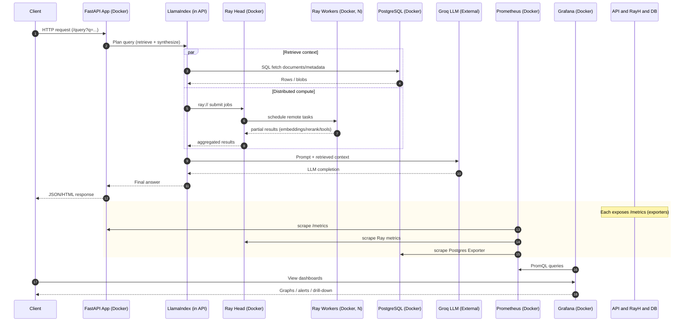

# Local LlamaIndex set up with Ray

This repository provides a containerized environment for running LlamaIndex
 locally with Ray for distributed compute, PostgreSQL for storage, and Prometheus/Grafana for monitoring.

The system is designed for local experimentation, testing, and observability of end-to-end LlamaIndex workflows.




# How to run

## Requirements

### Required
* Docker

### Optional
* Python 3 (for local scripts or direct API interaction)

## Running the Stack

Start all services with:
```bash
docker compose up -d --build
```
This launches:
* FastAPI (LlamaIndex API)
* Ray head & worker
* PostgreSQL
* Prometheus and Grafana

# Testing

## API Health Check

```bash
curl -s http://localhost:8000/health | jq .
```

```json
{
  "ok": true,
  "service": "llamaindex-local-api"
}
```
## Database Connectivity

```bash
curl -s http://localhost:8000/db/ping | jq .
```

```json
{
  "ok": true,
  "result": 1
}
```

## Read/Write to Database

```bash
curl -s -X POST http://localhost:8000/notes \
  -H "Content-Type: application/json" \
  -d '{"title":"hello","body":"world"}' | jq .
  ```

```json
{
  "title": "hello",
  "body": "world",
  "id": 1
}
```

## Ray Integration
Ping Ray

```bash
curl -s http://localhost:8000/ray/ping | jq .
```
Sample cosine similarity
```bash
curl -s "http://localhost:8000/ray/cosine?a=1,0,0&b=0.5,0.5,0" | jq .
```

## Monitoring
### Prometheus
Check if Prometheus is running
```bash
curl -s http://localhost:9090/-/healthy
```
Expected:
```bash
Prometheus is Healthy.
```
Check targets are being scraped:
```bash
curl -s http://localhost:9090/api/v1/targets | jq .
```

Check API metrics are exposed to Prometheus
```bash
curl -s http://localhost:8000/metrics | head -n 20
```